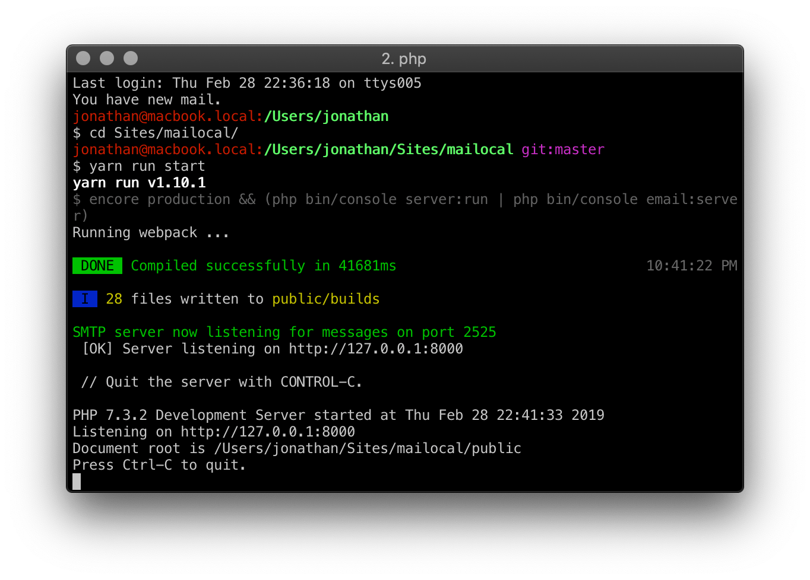

# Mailocal

Safely test sending your emails by using this local SMTP server and viewing the results on the web interface.

By using this locally installed SMTP server you can be sure that your real customers will never see your test emails!

However you can see all of them by simply opening the provided interface in any browser.

## Screenshots

## Requirements
- [php 7.3](https://php.net)
- ext-curl (php7.2-curl)
- ext-mbstring (php7.2-mbstring)
- ext-sqlite3 (php7.2-sqlite3)
- ext-xml (php7.2-xml)
- ext-zip (php7.2-zip)
- [composer](https://getcomposer.org)

If you don't have Composer yet, download it following the instructions on
[http://getcomposer.org/](http://getcomposer.org/) or just run the following command:

    curl -s http://getcomposer.org/installer | php

## Install

- `composer create-project jfoucher/mailocal`
- That's it

## Running

- `cd mailocal` to enter the directory just created by composer
- Run `bin/mailocal` to run both the SMTP server and the web server

Alternatively you can:

- Run `yarn run build` to build the frontend assets
- `php bin/console email:server` to launch the SMTP server
- `php bin/console server:start` to start Symfony's built-in web server

## Configuration

- Configure your other apps to use this new local SMTP server:
  - host: `127.0.0.1`
  - port: `2525` (or the one you chose, see below)
  - You can configure a SMTP username and password by setting the `SMTP_SERVER_USER` and `SMTP_SERVER_PASSWORD` fields in your `.env` file. Make sure you update your email client's credentials accordingly.
- [Mailocal](/) uses an SQLite database by default (in `var/data.db`) but you can choose to use any other database by setting the correct URL in the `.env` file.
- By default, `bin/mailocal` will start a web server that listens on 127.0.0.1 (address) and the first free port starting from 8000.  This is where you can view any emails you receive.  You can force `bin/mailocal` to always listen on a specific address/port by setting the value of `WEB_SERVER_ADDRESSPORT` in your `.env` file.  The value can be address:port, address, or port.

## Done
You can now view any emails you receive by opening http://127.0.0.1:8000 in your browser

The SMTP runs on port 2525 by default. Pass the `--port` option to use another one, like this: `php bin/console email:server --port=587`

## License

This project is licensed under the MIT License - see the [LICENSE.md](LICENSE.md) file for details

## Warning

Never use this in production, only run it on your local machine.
