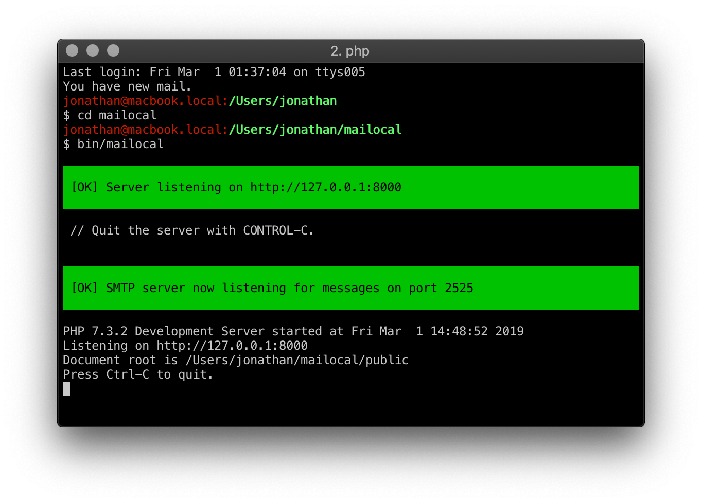

## Installation

### Requirements

- [php](https://php.net)
- [git](https://git-scm.com/downloads)
- [yarn](https://yarnpkg.com)
- [composer](https://getcomposer.org)

### Install

- `git clone git@github.com:jfoucher/mailocal.git && cd mailocal`
- `composer install`

### Running

{:refdef: style="text-align: center;"}

{: refdef}

- Run `yarn run start` to build and run everything

Alternatively you can:

- Run `yarn run build` to build the frontend assets
- `php bin/console email:server` to launch the SMTP server
- `php bin/console server:start` to start Symfony's built-in webserver

### Configuration

- Configure your other apps to use this new local SMTP server : 
  - host : `127.0.0.1`
  - port: `2525` (or the one you chose, see below)
  
- You can configure an SMTP username and password by setting the `SMTP_SERVER_USER` and `SMTP_SERVER_PASSWORD`
 fields in your `.env` file. Make sure you update your email client's credentials accordingly.
- [Mailocal](/) uses an SQLite database by default (in `var/data.db`) but you can choose to use any other database by setting the correct URL in the `.env` file
 
### Done

You can now view any emails you receive by opening http://localhost:8000 in your browser

The SMTP runs on port 2525 by default. Pass the `--port` option to use another one, like this: `php bin/console email:server --port=587`
  
### Warning

Never use this in production, only run it on your local machine.
